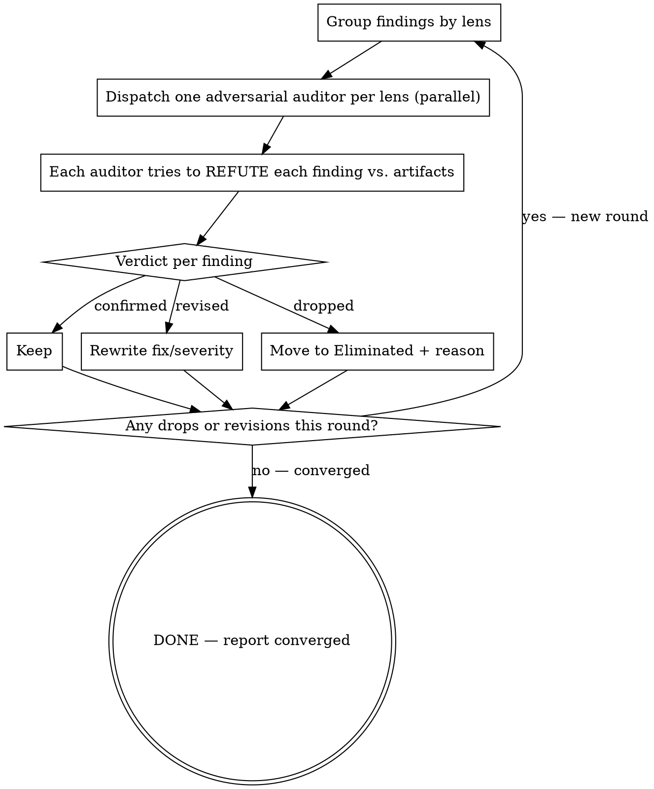

# Audit Loop — adversarial false-positive elimination

Phase 5. Iteratively verify the compiled findings against the real artifacts until a full round produces no new changes (convergence). Same convergence engine as a classic artifact audit, retargeted from codebase-claim verification to UX-finding verification, run as parallel per-lens adversaries, and with **logged** (never silent) eliminations.

## Process

## The adversarial auditor subagent

One fresh subagent per lens, in parallel. Its prompt contains:

1. `Respond in <detected language>.`
2. The Phase 1 frame + the artifacts (auditors verify against the real surface, not memory of it).
3. Only **that lens's** findings (keeps contexts isolated and skeptical, mirrors the fan-out).
4. If the user chose branch A: the user's stated fix preferences (so the auditor judges severity/fix against what the user actually wants).
5. This stance: *"Your job is to REFUTE each finding. Default to false-positive when uncertain. For each finding return a verdict."*

The auditor must be a **different context** from the lens that produced the finding — never let the producing agent grade its own work (confirmation bias is the whole thing we are defending against).

## Verdicts

For each finding the auditor returns one of:

- **confirmed** — the issue is real, the principle is correctly applied, the severity is fair, the fix is sound. Keep as-is.
- **revised** — real, but something is off: wrong principle, mis-scaled severity, or a fix that doesn't actually reduce load (or just moves it onto the user — Tesler check). Return the corrected version.
- **dropped** — false positive: the issue isn't really there, the principle is misapplied, or it's taste dressed as research. Return the reason.

## Logging rule (binding)

Every dropped finding moves to an **"Eliminated (false positives)"** section of the report with its drop reason. **Never delete a finding silently.** Silent drops hide whether the audit is working and erase the reasoning the user needs to trust the result.

## Round reporting

After each round state: **Round N: X verified, Y revised, Z dropped.**
- If Y+Z > 0: apply changes, start round N+1.
- If Y+Z = 0: **Audit converged. Report is clean.**

## What auditors commonly catch

- A "Critical" finding that only a tiny fraction of users ever hit (reach inflation).
- A fix that removes **germane** load — making the product unlearnable to look "simpler."
- A fix that just relocates complexity onto the user (the opposite of Tesler-correct).
- A principle cited by name but not actually what's happening on the surface.
- Two lenses that independently flagged the same root issue (merge, don't double-count).
